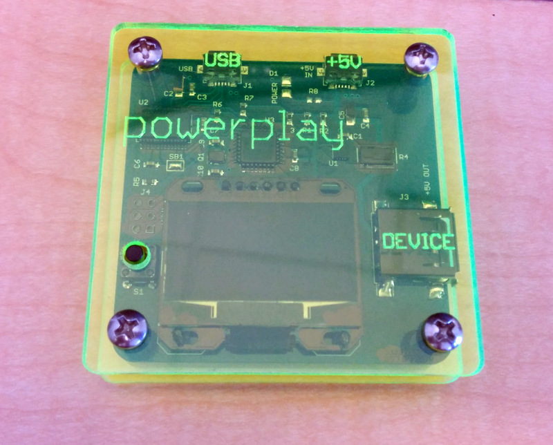

POWER PLAY
==========

POWER PLAY are Arduino based smart power monitors that are used to measure and optimize the power consumption of battery operated devices such as smart phones. 

Following is a description of the POWER PLAY models.

POWER PLAY 3.8V
---------------

This model provides the most accurate results but requires modifying the tested device. The POWER PLAY 3.8V outputs regulated 3.8 volts are simulates the power provided by a single cell Li-Ion battery cell. It requires disconnecting the battery from the tested device and hooking the output of the POWER PLAY 3.8V instead.

This model has 1.3" OLED display and on board analysis firmware such that it can be operated standalone. In addition is has a FTDI/USB output port that can be used to log the raw data on an attached computer and use it latter for additional analysis.

POWER PLAY 3.8V
---------------

This model is identical to the POWER PLAY 3.8V except that it does not have the 3.8V regulator and instead it outputs a pass through 5V. It is intended to be used with unmodified test device by connecting the power to the charger input of the test device and measuring the current fluctuations after the internal battery is fully charged. This method provides less accurate results than the POWER PLAY 3.8V (with the battery removed) but is easier to use since it does not require modifying the test devices.
