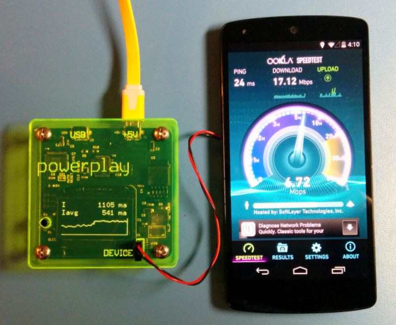

TODO: rough draft. Edit and spell check.

POWER-PLAY 3V8
==============

## OVERVIEW
Power-Play 3V8 is an Arduino based measurement tool that is used to measure the power consumption of mobile devices under different conditions and software versions. It provides 3.8V 2A DC power that simulates a single cell Li-ion battery and is connected to the device **instead of the battery**. The Power-Play 3V8 analyzes the current pattern consummed by the devcie and provides aggregated data on an integral a 1.3" OLED display. It also output the data to a USB/Serial port so it can be logged by a computer for further analysis. The computer based logging is optional and in most cases not necesary since the Power-Play 3V8 provides the key aresults on the display in real time (e.g. the average current consumption over the measurement period).

**WARNING using the Power-PLay 3V8 required modified devices with batteries removed. This modification should be done by qualified persons only due to the risk of fire, personal injury and even death. The Power-Play 3V8 information is provided here as-is and you must consult a qualified person before using it in any way. NEVER operate the Power-Play 3V8 with the battery connected to the device under test.**

1. +5V power input micro USB connector. This connector should be connected to a standard 5V charger and is used to power the Power-Play 3V8 and the device under test. It is important to use a charger that can provide sufficient current even during peak current consumption by the device under test. When testing a typicall smark phone, powering the Power-Play 3V8 from a USB port or a small 1A charger typically result in insufficient current and unstable operation.

2. Power output connection to the device. This is a 3 pin standard servo connector (JR and Hitec style) with ground at the center pin and 3.8V DC (typical) at the two end pins (it's sufficient to use only one of them). This output voltage is adjustable (see below) and is connected to the devcie instead of the battery, emulating a single cell Lithium-ion battery.

3. USB connector. Using this connector is optional. It allows to log the raw data on an attached computer for later analysis. This connector implements a FTDI serial over USB port and can be access as a serial port on standard Mac OSX, Linux and Windows computers without additional drivers. The emulated serial port is 115.2kbs, 8 data bit, no parity and the data is in ASCII text format.

4. Display. This is a 1.3" monochrome OLED display that shows the analysis results. The display supports multiple pages with different data items.

5. Operation button. A short click switch the displyed data page and a long press (~4 seconds) resets the analysis variables and starts a new analysis session. Holding this button pressed while powering the Power-Play 3V8 activates the test screen (for post manufacturing tests).

6. This is a multi turn trim potentionameter that allows to adjust the output voltage in the range 3.6V - 4.2V. It is acceccible from the side of the Power-Play 3V8 and requires a small flat screwdriver.

7. Auto Reset. This is a solder jumper on the PCB that controls the the USB auto reset feature. When shorted, establishing a new connection via the USB connector resets the Power-Play 3V8. This is useful when developing firmaware for the Power-Play 3V8 using the Arduino IDE. If the auto reset is not desired (e.g. in order to have analysis sessions non interuppted by connecting the USB port), the short should be disconnected with a solder iron (after removing the 4 top screws and top cover).

pmon_3v8_closeup_annotated.png
TODO: add an overall picture with annotation for connectors, display, button and trim pot.

## FUNCTIONAL BLOCK DIAGRAM

* **Voltage regulator** - a 5V to 3.8v low dropout (LDO) voltage regulator. The output voltage (nominal 3.8V) can be set by the small multi turn potentiometer on the right hand of the device.
* **Shunt resistor** - this is a small (25 milliohms) 1% Kelvin resistor that is used to sample the current consummed the the device. The voltage drop on the shunt does not affect the output voltage of the Power-Play 3V8 because of the feedback loop between the output voltage and the LDO.
* **Colulomb counter** - this is an analog circuit that continosly integrate the current through the shunt resistor and generates a pulse ('tick') whenever the charge since the last tick reaches a predefined value. (charge is the integral of current over time and is measured in Ampere Hours). For more information read the LTC2943 datasheet at http://www.linear.com/product/LTC2943.
* **Charge counter** - this is a digital counter that counts the Coulomb coungter ticks. It provides the long term current integration.
* **Analysis** - this is firmware that tracks the current patterns and computes real time summary data such as momentary current, accoumlated charge, number of times device transitioned from standby to wake mode and so on.
* **Display** - a small 1.3" OLED display that display the analysis results. The display has several pages, ecch with different data items, that can be switched using the button.
* **Computer** - this is an optional computer that logs the data over a USB connection. In most cases, the results displayed on the OLED displayed are suficcien and the comptuer is not necesary. 

## CONNECTION DIAGRAM

Plug the +5V micro usb connector to a USB charger with sufficient current (e.g. 2A). Plug the modified device to the DEVICE connector. Optional: to log the data on a computer connect the USB port to a computer and run a logging program or script (the Power-Play 3V8 looks like a 115.2kbs FTDI serial over USB port).

## ANALYSIS

The Power-Play 3V8 performs the analysis by dividing the time into slots of 100ms each (10Hz). For each time slot the analsys firmware samples the number of harge ticks occured in that time slot (partial ticks are rolled to the next timeslots, avoiding intergration errors) and tracks the total ticks and time in global analysis counters. These counters are reset when the analysis is reset by long pressing the button. These values are used to compute, report and display the following values among others:

* Charge in last time slot.
* Average current during last time slot.
* Last time slot classification (I < ~80ma ? 'standby' : 'wake').
* Total analysis time.
* Total analysis charge (AmpHour).
* Average current during the analysis period.
* Total times of 'wake' and 'standby' slots.
* Total charge in 'wake' and 'standby' slots.
* Number of transitions from a 'standby' to 'wake' time slot.

The most important value from the above list is the average current during the analsys since it is inversly proportional to the expected battery life (for a given battery capacity).

Note: the ananlysis also samples and reports the momentary voltage levle at each slot but in general it assumes that the voltage is fixed and thus does not track power (Watt) or energy (Watt Hour).

## OPERATION

Operating the Power-Play 3V8 is very simple. Connect the Power-Play 3V8 to a 5V charger and the device under test as described above, reset the analysis by long pressing the button (~4 seconds) and let the device operate under the desired conditions. The analysis is done is real time and the results are shown on the display. Click the button to switch between display pages to see the desired values. 

## LOG FORMAT
TODO

## INSTRUMETING A DEVICE
TODO

## FIRMWARE DEVELOPEMENT
TODO

## BUILDING POWER-PLAY 3V8
TODO

