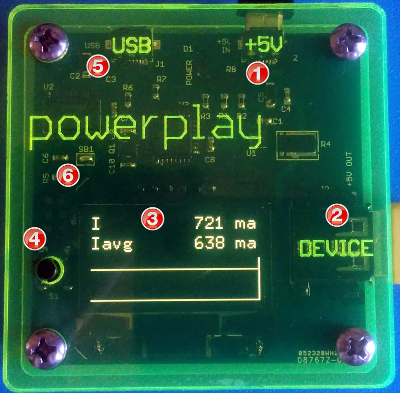

POWER PLAY 3V8
==============

## OVERVIEW
POWER PLAY 5V is identical to the POWER PLAY 3.8V except that it passes through the input 5V instead of down regulating it to 3.8V. This allows to use unmodified test devices (that is, no need to remove the battery) and the cost of slightly less accurate results do the quiescent current of the internal charger circuitry of the test devices and potential difference is software behavior due to the detection of the charger power. 

Since many aspects of POWER PLAY 5V are identical to POWER PLAY 3.8V, we list here only the differences.

1. +5V power input micro USB connector. Identical to POWER PLAY 3.8V.

2. Power output connection to the device. Connect this using a short USB cable to the test device.

3. Display. Identical to POWER PLAY 3.8V.

4. Operation button. Identical to POWER PLAY 3.8V.

5. USB connector. Identical to POWER PLAY 3.8V.

6. Auto Reset solder jumper. Identical to POWER PLAY 3.8V.

## FUNCTIONAL BLOCK DIAGRAM

Identical to POWER PLAY 3.8V except that a pass through wire replaces the 3.8V regulator.

## CONNECTION DIAGRAM

Identical to POWER PLAY 3.8V except that the test device is powered via its USB charger port.

## ANALYSIS

Identical to POWER PLAY 3.8V.

## OPERATION

1. Connect the +5V connector to 2A or larger charger.
2. Connect the DEVICE connector to the charger port of the test device (e.g. Nexus 5).
3. Wait until the device is *fully* charged.
4. Long press the button to reset the analysis and let POWER PLAY monitor the current for some time.
5. Note the Iavg value. This is the baseline current consumption of your device.
6. Install the new app and repeat steps 4, 5. The difference in Iavg values with and without the app indicates the power consumption of the app (lower is better).
7. Optimize the app and repeat. Your users will love you for better battery life.

## LOG FORMAT

Identical to POWER PLAY 3.8V.

## INSTRUMENTING A DEVICE

Not required.

## FIRMWARE DEVELOPMENT

Identical to POWER PLAY 3.8V.

## BUILDING POWER PLAY 5V. 

Similar to POWER PLAY 3.8V.

