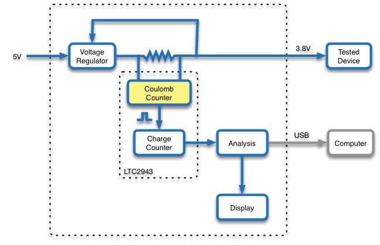
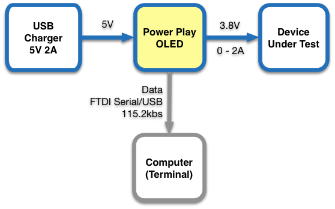

TODO: rough draft. Edit and spell check.

POWER-PLAY OLED
===============

## OVERVIEW
Power-Play OLED is an Arduino based measurement tool that is used to measure the power consumption of mobile devices under different conditions and software versions. It provides 3.8V 2A DC power that simulates a single cell Li-ion battery and is connected to the device **instead of the battery**. The Power-Play OLED analyzes the current pattern consummed by the devcie and provides aggregated data on an integral a 1.3" OLED display. It also output the data to a USB/Serial port so it can be logged by a computer for further analysis. The computer based logging is optional and in most cases not necesary since the Power-Play OLED provides the key aresults on the display in real time (e.g. the average current consumption over the measurement period).

**IMPORTANT using the Power-PLay OLED required modified devices with batteries removed. This modification should be done by qualified persons only due to the risk of fire, personal injury and even death. The Power-Play OLED information is provided here as-is and you must consult a qualifying person before using it in any way. NEVER operate the Power-Play OLED with the battery connected to the device under test.**

TODO: add an overall picture with annotation for connectors, display, button and trim pot.

## FUNCTIONAL BLOCK DIAGRAM

* **Voltage regulator** - a 5V to 3.8v low dropout (LDO) voltage regulator. The output voltage (nominal 3.8V) can be set by the small multi turn potentiometer on the right hand of the device.
* **Shunt resistor** - this is a small (25 milliohms) 1% Kelvin resistor that is used to sample the current consummed the the device. The voltage drop on the shunt does not affect the output voltage of the Power-Play OLED because of the feedback loop between the output voltage and the LDO.
* **Colulomb counter** - this is an analog circuit that continosly integrate the current through the shunt resistor and generates a pulse ('tick') whenever the charge since the last tick reaches a predefined value. (charge is the integral of current over time and is measured in Ampere Hours). For more information read the LTC2943 datasheet at http://www.linear.com/product/LTC2943.
* **Charge counter** - this is a digital counter that counts the Coulomb coungter ticks. It provides the long term current integration.
* **Analysis** - this is firmware that tracks the current patterns and computes real time summary data such as momentary current, accoumlated charge, number of times device transitioned from standby to wake mode and so on.
* **Display** - a small 1.3" OLED display that display the analysis results. The display has several pages, ecch with different data items, that can be switched using the button.
* **Computer** - this is an optional computer that logs the data over a USB connection. In most cases, the results displayed on the OLED displayed are suficcien and the comptuer is not necesary. 

## CONNECTION DIAGRAM

Plug the +5V micro usb connector to a USB charger with sufficient current (e.g. 2A). Plug the modified device to the DEVICE connector. Optional: to log the data on a computer connect the USB port to a computer and run a logging program or script (the Power-Play OLED looks like a 115.2kbs FTDI serial over USB port).

## ANALYSIS

The Power-Play OLED performs the analysis by dividing the time into slots of 100ms each (10Hz). For each time slot the analsys firmware samples the number of harge ticks occured in that time slot (partial ticks are rolled to the next timeslots, avoiding intergration errors) and tracks the total ticks and time in global analysis counters. These counters are reset when the analysis is reset by long pressing the button. These values are used to compute, report and display the following values among others:

* Charge in last time slot.
* Average current during last time slot.
* Last time slot classification (I < ~80ma ? 'standby' : 'wake').
* Total analysis time.
* Total analysis charge (AmpHour).
* Average current during the analysis period.
* Total times of 'wake' and 'standby' slots.
* Total charge in 'wake' and 'standby' slots.
* Number of transitions from a 'standby' to 'wake' time slot.

The most important value from the above list is the average current during the analsys since it is inversly proportional to the expected battery life (for a given battery capacity).

Note: the ananlysis also samples and reports the momentary voltage levle at each slot but in general it assumes that the voltage is fixed and thus does not track power (Watt) or energy (Watt Hour).

## OPERATION

Operating the Power-Play OLED is very simple. Connect the Power-Play OLED to a 5V charger and the device under test as described above, reset the analysis by long pressing the button (~4 seconds) and let the device operate under the desired conditions. The analysis is done is real time and the results are shown on the display. Click the button to switch between display pages to see the desired values. 

TODO: include sample screen shots.

## LOG FORMAT
TODO

## INSTRUMETING A DEVICE
TODO

## FIRMWARE DEVELOPEMENT
TODO

## BUILDING POWER-PLAY OLED
TODO

